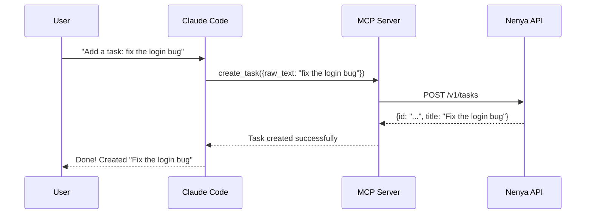

The Nenya CLI provides a [Model Context Protocol (MCP)](https://modelcontextprotocol.io/) server that lets AI assistants manage your tasks directly. It works with Claude Code, and any other MCP-compatible client.

## How it works

The MCP server runs as a local process, communicating with Claude Code over **stdio** using JSON-RPC. It authenticates to the Nenya API using OAuth 2.0 with PKCE, so your credentials never pass through the AI assistant.

## Features

- **9 tools** for complete task management (create, read, update, delete, complete, search, stats)
- **Automatic authentication** via OAuth 2.0 with browser-based consent
- **Secure credential storage** in `~/.nenya/credentials.json`
- **Automatic token refresh** when credentials expire
- **Zero configuration** after initial install

## Requirements

- Node.js >= 18.0.0
- A [Nenya account](https://app.nenyahq.com)

## Next steps

<CardGroup cols={2}>
  <Card title="Installation" icon="download" href="/cli/installation">
    Install and configure the MCP server.
  </Card>
  <Card title="Available Tools" icon="wrench" href="/cli/tools">
    See every tool the MCP server exposes.
  </Card>
</CardGroup>
